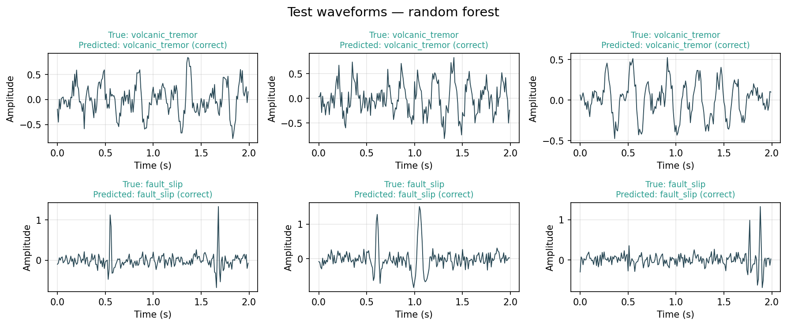
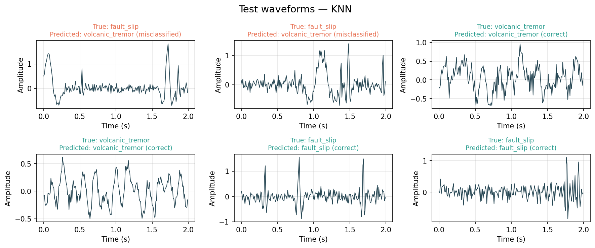
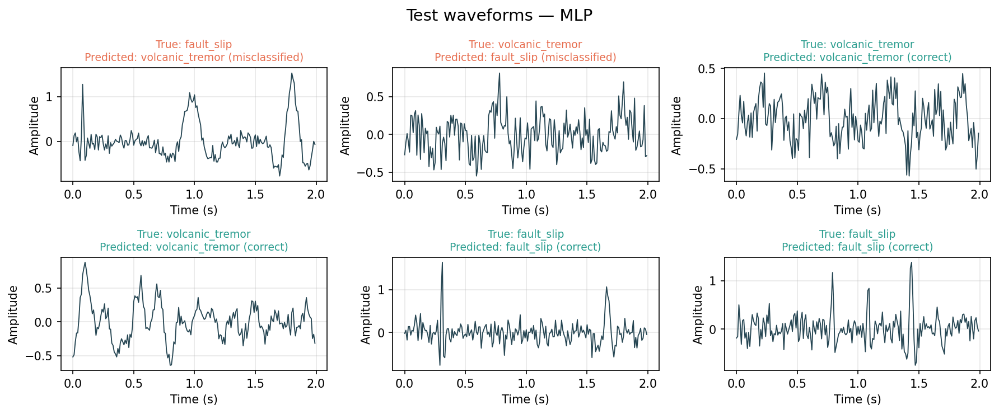
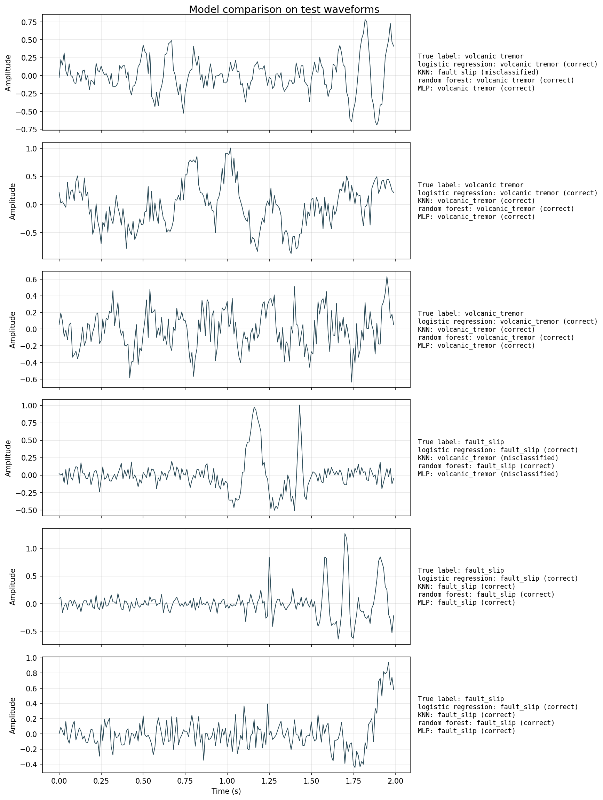

# Synthetic Seismic Waveform Classifier

A machine learning project that generates synthetic seismic waveforms and trains several classifiers to distinguish between two types of geological events.

The aim of the project is to compare how different machine learning models perform on a simple classification problem using entirely synthetic data.

## Dataset

The dataset is generated at runtime and contains two waveform classes:

- **Volcanic tremor** – continuous oscillating signals with slowly varying amplitude.
- **Fault slip** – impulsive events modelled using Ricker wavelets with random timing.

Random noise is added to every waveform to make the classification task more realistic.

## Models

The following classifiers are implemented:

- Logistic Regression
- K-Nearest Neighbours (KNN)
- Random Forest
- Multi-layer Perceptron (MLP)

Each model is trained on an 80/20 train-test split before being evaluated on unseen data.

## Installation

Clone the repository and install the required packages.

```bash
pip install -r requirements.txt
```

## Running the project

Train and evaluate every model:

```bash
python3 main.py
```

Or train a single model while developing:

```bash
python3 main.py -logistic-regression
python3 main.py -knn
python3 main.py -random-forest
python3 main.py -mlp
```

Generated figures are saved to the `outputs/` directory.

## Results

Example predictions produced by the models.

### Random Forest

The Random Forest consistently separates the two waveform classes on this synthetic dataset.



### KNN



### Multi-layer Perceptron



### Model comparison

The comparison figure shows predictions from all four classifiers for the same set of test waveforms.

